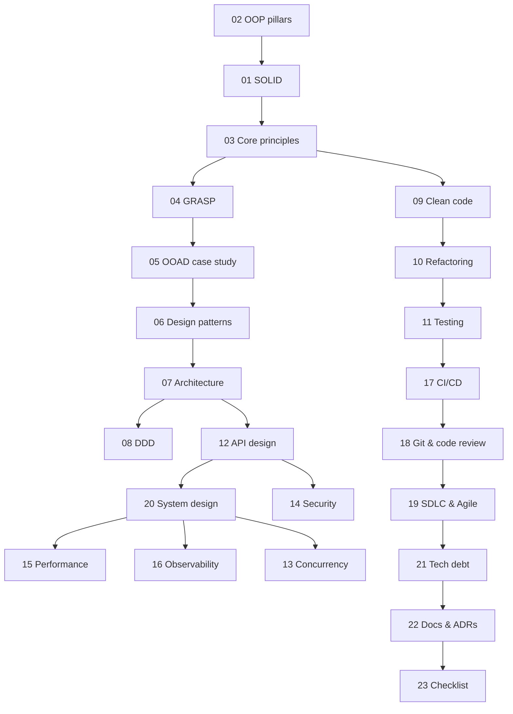

# Learning path map

```mermaid
flowchart TD
  OOP[02 OOP pillars] --> SOLID[01 SOLID] --> CORE[03 Core principles] --> GRASP[04 GRASP]
  GRASP --> OOAD[05 OOAD case study] --> GOF[06 Design patterns]
  GOF --> ARCH[07 Architecture] --> DDD[08 DDD]
  CORE --> CLEAN[09 Clean code] --> REF[10 Refactoring] --> TEST[11 Testing]
  ARCH --> API[12 API design] --> SD[20 System design]
  TEST --> CICD[17 CI/CD]
  SD --> PERF[15 Performance] & OBS[16 Observability] & CONC[13 Concurrency]
  API --> SEC[14 Security]
  CICD --> VCS[18 Git & code review] --> SDLC[19 SDLC & Agile]
  SDLC --> DEBT[21 Tech debt] --> DOCS[22 Docs & ADRs] --> CHECK[23 Checklist]
```
